# Mermaid Rule Maps

This document exists so the Academic Reading Key is not detached from the visual maps it describes.

## Reading Order

1. Read `docs\Academic-Reading-Key.md`.
2. Review the full academic map below.
3. Use `docs\ADG-Duali-Rules.md` to inspect each rule row and proof degree.

## Full Academic Map

```mermaid
flowchart TB

A["أبو الأسود الدؤلي<br/>النواة المؤسسة لعلم النحو العربي"]
A --> B["المستوى الأول<br/>نصوص منقولة بلفظها أو شبه لفظها"]
A --> C["المستوى الثاني<br/>أبواب نحوية منسوبة تاريخيًا"]
A --> D["المستوى الثالث<br/>نظام النقط والضبط"]
A --> E["المستوى الرابع<br/>قواعد تشغيلية مستنبطة"]
A --> F["المستوى الخامس<br/>حدود النسبة التاريخية"]

B --> B1["تقسيم الكلام"]
B1 --> B1a["الكلام كله: اسم / فعل / حرف"]
B --> B2["تعريف الاسم"]
B2 --> B2a["الاسم: ما أنبأ عن المسمى"]
B --> B3["تعريف الفعل"]
B3 --> B3a["الفعل: ما أنبأ عن حركة المسمى"]
B --> B4["تعريف الحرف"]
B4 --> B4a["الحرف: ما أنبأ عن معنى<br/>ليس باسم ولا فعل"]
B --> B5["تقسيم الأشياء"]
B5 --> B5a["ظاهر"]
B5 --> B5b["مضمر"]
B5 --> B5c["شيء ليس بظاهر ولا مضمر"]

C --> C1["باب الفاعل"]
C --> C2["باب المفعول"]
C --> C3["باب المضاف"]
C --> C4["حرف / حروف الرفع"]
C --> C5["حروف النصب"]
C --> C6["حرف / حروف الجر"]
C --> C7["حرف / حروف الجزم"]
C --> C8["باب التعجب"]
C5 --> C5a["إنّ"]
C5 --> C5b["أنّ"]
C5 --> C5c["ليت"]
C5 --> C5d["لعلّ"]
C5 --> C5e["كأنّ"]
C5 --> C5f["لكنّ"]
C8 --> C8a["تمييز التعجب من الاستفهام"]
C8 --> C8b["نمط: ما أفعلَه"]

D --> D1["الفتحة"]
D1 --> D1a["نقطة فوق الحرف"]
D --> D2["الضمة"]
D2 --> D2a["نقطة أمام / بين يدي الحرف"]
D --> D3["الكسرة"]
D3 --> D3a["نقطة تحت الحرف"]
D --> D4["التنوين / الغنة"]
D4 --> D4a["نقطتان بدل نقطة واحدة"]
D --> D5["السكون"]
D5 --> D5a["تركه بلا نقطة في النظام الأول"]

E --> E1["الإعراب علامة وظيفة"]
E1 --> E1a["الرفع والنصب والجر والجزم<br/>تحدد علاقة الكلمة بغيرها"]
E --> E2["الحركة تحفظ المعنى"]
E2 --> E2a["اختلاف الحركة قد يقلب المعنى"]
E --> E3["الحرف أداة عاملة"]
E3 --> E3a["الحرف قد يؤثر فيما بعده"]
E --> E4["تمييز الفاعل والمفعول"]
E4 --> E4a["الفاعل مرتبط بمن قام بالفعل"]
E4 --> E4b["المفعول مرتبط بمن وقع عليه الفعل"]
E --> E5["الإضافة علاقة اسمية"]
E5 --> E5a["المضاف يحتاج إلى متمم / مخصص"]
E --> E6["النقط طبقة تفسيرية"]
E6 --> E6a["علامات فوق النص الأصلي<br/>لمنع اللبس في القراءة"]
E --> E7["التتبع والزيادة"]
E7 --> E7a["قاعدة تبدأ بأصل<br/>ثم تستكمل بالمراجعة"]

F --> F1["ثابت نسبيًا"]
F1 --> F1a["تقسيم الكلام"]
F1 --> F1b["تعريف الاسم والفعل والحرف"]
F1 --> F1c["تعليمات النقط"]
F --> F2["منسوب كباب"]
F2 --> F2a["الفاعل"]
F2 --> F2b["المفعول"]
F2 --> F2c["المضاف"]
F2 --> F2d["الرفع / النصب / الجر / الجزم"]
F2 --> F2e["التعجب"]
F --> F3["مستنبط تشغيليًا"]
F3 --> F3a["النقط كـ Metadata"]
F3 --> F3b["الإعراب كآلية Parsing"]
F3 --> F3c["الحركة كإشارة دلالية"]
F --> F4["غير منسوب بدقة"]
F4 --> F4a["تفصيلات سيبويه والخليل"]
F4 --> F4b["الأبواب المدرسية المتأخرة"]
F4 --> F4c["نظرية العامل بصورتها الكاملة"]

classDef textual fill:#DFF5E1,stroke:#2E7D32,stroke-width:1.5px,color:#111;
classDef attributed fill:#E3F2FD,stroke:#1565C0,stroke-width:1.5px,color:#111;
classDef notation fill:#FFF3E0,stroke:#EF6C00,stroke-width:1.5px,color:#111;
classDef inferred fill:#F3E5F5,stroke:#6A1B9A,stroke-width:1.5px,color:#111;
classDef limits fill:#ECEFF1,stroke:#455A64,stroke-width:1.5px,color:#111;

class B,B1,B1a,B2,B2a,B3,B3a,B4,B4a,B5,B5a,B5b,B5c textual;
class C,C1,C2,C3,C4,C5,C6,C7,C8,C5a,C5b,C5c,C5d,C5e,C5f,C8a,C8b attributed;
class D,D1,D1a,D2,D2a,D3,D3a,D4,D4a,D5,D5a notation;
class E,E1,E1a,E2,E2a,E3,E3a,E4,E4a,E4b,E5,E5a,E6,E6a,E7,E7a inferred;
class F,F1,F1a,F1b,F1c,F2,F2a,F2b,F2c,F2d,F2e,F3,F3a,F3b,F3c,F4,F4a,F4b,F4c limits;
```

